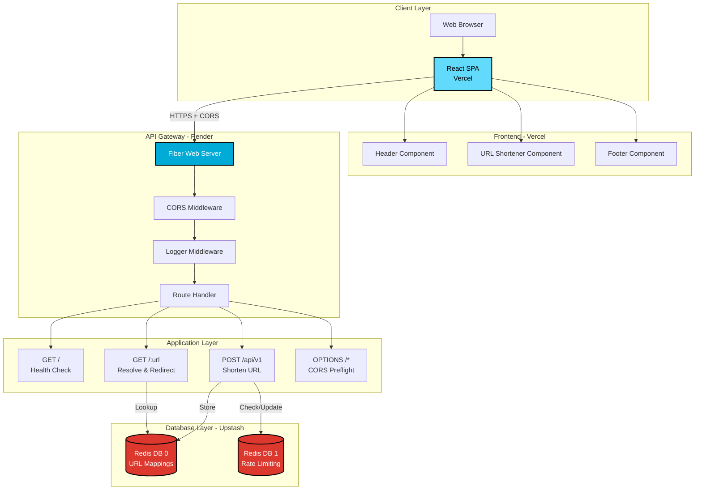
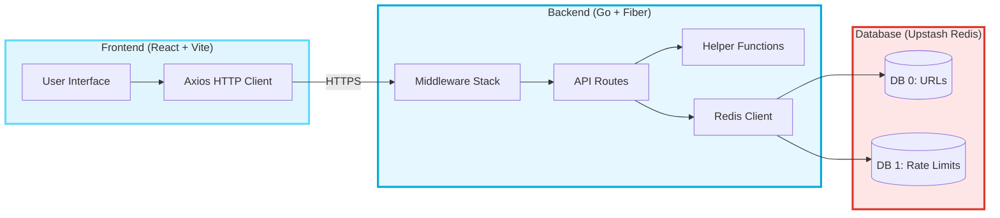
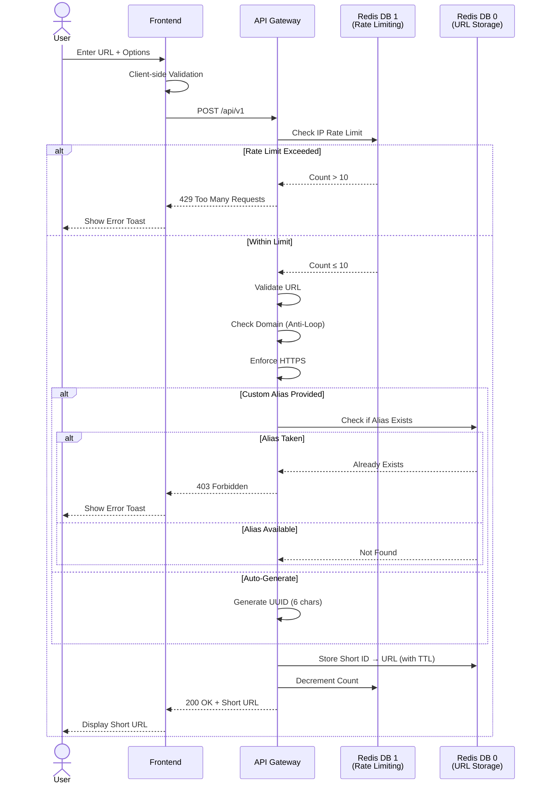
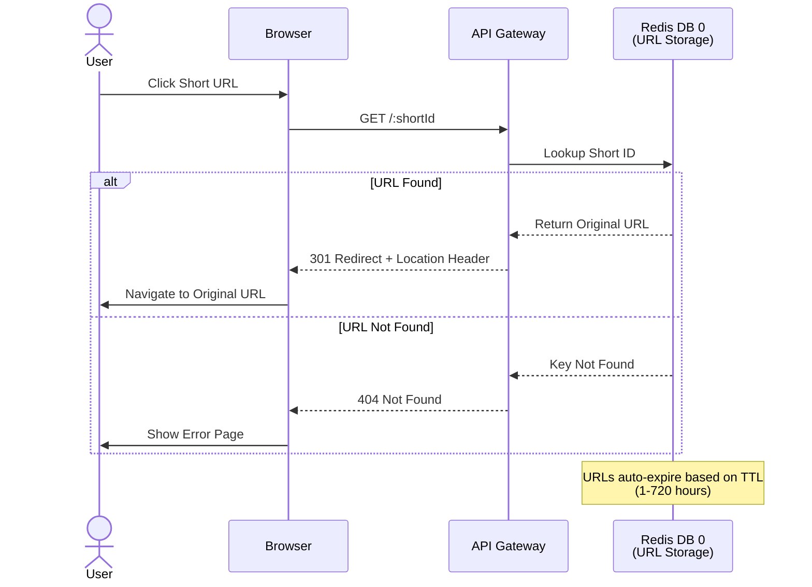
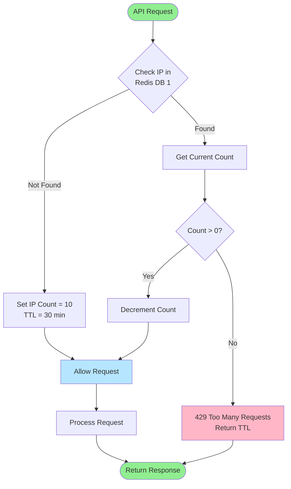

<div align="center">


<h1 style="font-size:64px; font-weight:800; margin:20px 0;">MINIFY</h1>

<br/>

[](https://go.dev/)
[](https://reactjs.org/)
[](https://gofiber.io/)
[](https://upstash.com/)
[](https://vitejs.dev/)
[](https://www.docker.com/)

[](https://render.com/)
[](https://vercel.com/)

[Live Demo](https://minify-links.vercel.app) • [Report Bug](https://github.com/richochetclementine1315/Minify/issues) • [Request Feature](https://github.com/richochetclementine1315/Minify/issues)

</div>

---

## 📋 Table of Contents

- [About](#-about)
- [Features](#-features)
- [Tech Stack](#-tech-stack)
- [System Architecture](#-system-architecture)
- [Project Structure](#-project-structure)
- [Getting Started](#-getting-started)
- [API Documentation](#-api-documentation)
- [Deployment](#-deployment)
- [Environment Variables](#-environment-variables)
- [Contributing](#-contributing)
- [License](#-license)

---

## 🎯 About

**Minify** is a modern, high-performance URL shortener built with Go and React. It provides a clean, intuitive interface for creating shortened URLs with custom aliases, expiration times, and built-in rate limiting to prevent abuse.

### Why Minify?

- ⚡ **Blazing Fast** - Built with Go's Fiber framework for sub-millisecond response times
- 🎨 **Modern UI** - Glassmorphism design with smooth animations
- 🔒 **Secure** - Rate limiting, input validation, and CORS protection
- 🐳 **Docker Ready** - Containerized for easy deployment
- 📊 **Redis Powered** - Lightning-fast caching and data persistence
- 🌐 **Cloud Native** - Deployed on Render (backend) and Vercel (frontend)

---

## ✨ Features

### Core Functionality

- 🔗 **URL Shortening** - Convert long URLs into short, shareable links
- ✏️ **Custom Aliases** - Create memorable custom short URLs
- ⏰ **Expiration Control** - Set custom expiration times (1-720 hours)
- 🔄 **Automatic Redirects** - Fast redirects from short URLs to original destinations
- 📱 **Responsive Design** - Works seamlessly on desktop, tablet, and mobile

### Advanced Features

- 🛡️ **Rate Limiting** - IP-based rate limiting (10 requests per 30 minutes)
- ✅ **URL Validation** - Ensures only valid URLs are shortened
- 🔒 **HTTPS Enforcement** - Automatically upgrades URLs to HTTPS
- 🚫 **Anti-Loop Protection** - Prevents shortening of Minify URLs
- 📋 **One-Click Copy** - Copy shortened URLs with a single click
- 🎨 **Toast Notifications** - Beautiful feedback for all actions

### Developer Features

- 🔍 **Health Check Endpoint** - Monitor API status
- 📝 **Comprehensive Logging** - Request/response logging
- 🐛 **Error Handling** - Detailed error messages for debugging
- 🔌 **RESTful API** - Clean, predictable API design

---

## 🛠️ Tech Stack

### Backend

| Technology | Purpose | Version |
|------------|---------|---------|
|  | Core Language | 1.24 |
|  | Web Framework | v2.52.9 |
|  | Database & Cache | Latest |
|  | Containerization | Latest |

**Key Backend Packages:**
- `gofiber/fiber/v2` - Fast HTTP framework
- `go-redis/redis/v8` - Redis client
- `google/uuid` - UUID generation for short URLs
- `asaskevich/govalidator` - URL validation
- `joho/godotenv` - Environment variable management

### Frontend

| Technology | Purpose | Version |
|------------|---------|---------|
|  | UI Library | 18.2.0 |
|  | Build Tool | 5.0.0 |
|  | HTTP Client | 1.6.0 |

**Key Frontend Packages:**
- `react` & `react-dom` - Core React libraries
- `axios` - API communication
- `react-toastify` - Toast notifications
- `react-icons` - Icon library

### Infrastructure & Deployment

| Service | Purpose |
|---------|---------|
|  | Backend Hosting |
|  | Frontend Hosting |
|  | Serverless Redis |
|  | Version Control & CI/CD |

---

## 🏗️ System Architecture

### High-Level Architecture



### System Components



### Data Flow

#### 1️⃣ **Shorten URL Workflow**



#### 2️⃣ **Resolve URL Workflow**



#### 3️⃣ **Rate Limiting Flow**



---

## 📁 Project Structure

```
Minify/
├── 📂 api/                          # Backend (Go)
│   ├── 📂 database/
│   │   └── database.go              # Redis client initialization
│   ├── 📂 helpers/
│   │   └── helpers.go               # URL validation & utilities
│   ├── 📂 routes/
│   │   ├── shorten.go               # URL shortening logic
│   │   └── resolve.go               # URL resolution/redirect
│   ├── main.go                      # Application entry point
│   ├── go.mod                       # Go dependencies
│   ├── Dockerfile                   # Backend container config
│   └── .env                         # Environment variables (local)
│
├── 📂 frontend/                     # Frontend (React)
│   ├── 📂 src/
│   │   ├── 📂 components/
│   │   │   ├── Header.jsx           # App header
│   │   │   ├── Header.css
│   │   │   ├── Footer.jsx           # App footer
│   │   │   ├── Footer.css
│   │   │   ├── UrlShortener.jsx     # Main URL shortener form
│   │   │   └── UrlShortener.css
│   │   ├── App.jsx                  # Root component
│   │   ├── App.css
│   │   ├── main.jsx                 # React entry point
│   │   └── index.css                # Global styles
│   ├── 📂 public/
│   │   └── link.svg                 # Favicon
│   ├── index.html                   # HTML template
│   ├── package.json                 # Frontend dependencies
│   ├── vite.config.js               # Vite configuration
│   └── vercel.json                  # Vercel deployment config
│
├── 📂 db/
│   └── Dockerfile                   # Redis container config
│
├── 📂 data/
│   └── dump.rdb                     # Redis persistence file
│
├── docker-compose.yml               # Multi-container orchestration
├── DEPLOYMENT.md                    # Deployment guide
├── DEPLOYMENT_CHECKLIST.md          # Pre-deployment checklist
├── RENDER_ENV_SETUP.md              # Render environment setup
├── README.md                        # This file
└── .gitignore                       # Git ignore rules
```

---

## 🚀 Getting Started

### Prerequisites

- **Go** 1.24 or higher
- **Node.js** 18.x or higher
- **Redis** (or use Docker)
- **Docker** (optional, for containerized deployment)

### Local Development Setup

#### Option 1: Using Docker (Recommended)

1. **Clone the repository**
   ```bash
   git clone https://github.com/richochetclementine1315/Minify.git
   cd Minify
   ```

2. **Start all services with Docker Compose**
   ```bash
   docker-compose up --build
   ```

3. **Access the application**
   - Frontend: http://localhost:5173
   - Backend: http://localhost:3000
   - Redis: localhost:6379

#### Option 2: Manual Setup

**Backend:**

1. **Navigate to API directory**
   ```bash
   cd api
   ```

2. **Install dependencies**
   ```bash
   go mod download
   ```

3. **Create `.env` file**
   ```bash
   cp .env.example .env
   ```

4. **Configure environment variables**
   ```env
   DB_ADDRESS=localhost:6379
   DB_PASSWORD=
   API_QUOTA=10
   APP_PORT=:3000
   DOMAIN=http://localhost:3000
   APP_DOMAIN=localhost:3000
   ```

5. **Run the backend**
   ```bash
   go run main.go
   ```

**Frontend:**

1. **Navigate to frontend directory**
   ```bash
   cd frontend
   ```

2. **Install dependencies**
   ```bash
   npm install
   ```

3. **Create `.env` file**
   ```bash
   VITE_API_URL=http://localhost:3000
   ```

4. **Start development server**
   ```bash
   npm run dev
   ```

**Redis:**

```bash
# Using Docker
docker run -d -p 6379:6379 redis:alpine

# Or install locally
# macOS
brew install redis
redis-server

# Ubuntu/Debian
sudo apt-get install redis-server
sudo service redis-server start
```

---

## 📡 API Documentation

### Base URL
- **Production**: `https://minify-api-eytg.onrender.com`
- **Local**: `http://localhost:3000`

### Endpoints

#### 1. Health Check
```http
GET /
```

**Response:**
```json
{
  "status": "ok",
  "service": "Minify URL Shortener API",
  "version": "1.0.0"
}
```

---

#### 2. Shorten URL
```http
POST /api/v1
Content-Type: application/json
```

**Request Body:**
```json
{
  "url": "https://example.com/very-long-url",
  "short": "custom-alias",  // Optional: Leave as " " for auto-generated
  "expiry": 24              // Optional: Hours (default: 24)
}
```

**Success Response (200):**
```json
{
  "url": "https://example.com/very-long-url",
  "short": "https://minify-api-eytg.onrender.com/abc123",
  "expiry": 86400000000000,
  "rate_limit": 9,
  "rate_limit_reset": 30
}
```

**Error Responses:**

| Status | Error | Description |
|--------|-------|-------------|
| 400 | `cannot parse JSON` | Invalid JSON in request body |
| 400 | `Invalid URL` | URL format is invalid |
| 403 | `Custom short link already exists` | Alias is already taken |
| 429 | `Rate limit exceeded` | Too many requests (10/30min) |
| 500 | `Unable to connect to DB` | Redis connection failed |
| 503 | `Haha, nice try :(` | Attempting to shorten Minify URLs |

---

#### 3. Resolve Short URL
```http
GET /:shortId
```

**Example:**
```http
GET /abc123
```

**Success Response:**
- **Status**: `301 Moved Permanently`
- **Location**: Original URL
- Automatically redirects browser

**Error Response (404):**
```json
{
  "error": "short not found in the database"
}
```

---

### Rate Limiting

- **Limit**: 10 requests per IP address
- **Window**: 30 minutes
- **Reset**: Automatic after 30 minutes
- **Headers**: Check `rate_limit` and `rate_limit_reset` in response

---

## 🌐 Deployment

### Production Deployment

The application is deployed using:
- **Backend**: Render (https://minify-api-eytg.onrender.com)
- **Frontend**: Vercel (https://minify-links.vercel.app)
- **Database**: Upstash Redis (Serverless)

### Deploy Your Own Instance

#### Backend (Render)

1. **Create Render account** at https://render.com
2. **Create new Web Service**
   - Connect GitHub repository
   - Root Directory: `api`
   - Build Command: `go build -tags netgo -ldflags '-s -w' -o app`
   - Start Command: `./app`
3. **Set environment variables** (see [Environment Variables](#-environment-variables))
4. **Deploy!**

#### Frontend (Vercel)

1. **Create Vercel account** at https://vercel.com
2. **Import project** from GitHub
3. **Configure build settings:**
   - Framework: Vite
   - Root Directory: `frontend`
   - Build Command: `npm run build`
   - Output Directory: `dist`
4. **Set environment variable:**
   - `VITE_API_URL=https://your-backend-url.onrender.com`
5. **Deploy!**

#### Database (Upstash)

1. **Create account** at https://upstash.com
2. **Create Redis database**
   - Type: Regional (free tier)
   - Region: Closest to your backend
3. **Copy credentials:**
   - Endpoint (e.g., `xxx.upstash.io:6379`)
   - Password
4. **Use in Render environment variables**

📚 **Detailed deployment guide**: See [DEPLOYMENT.md](./DEPLOYMENT.md)

---

## 🔐 Environment Variables

### Backend (API)

| Variable | Description | Example |
|----------|-------------|---------|
| `DB_ADDRESS` | Redis server address with port | `intense-bug-5252.upstash.io:6379` |
| `DB_PASSWORD` | Redis authentication password | `your-redis-password` |
| `API_QUOTA` | Rate limit per 30 minutes | `10` |
| `APP_PORT` | Application port (with colon) | `:3000` or `:10000` |
| `DOMAIN` | Backend URL for short links | `https://minify-api-eytg.onrender.com` |
| `APP_DOMAIN` | Backend domain (no protocol) | `minify-api-eytg.onrender.com` |

### Frontend

| Variable | Description | Example |
|----------|-------------|---------|
| `VITE_API_URL` | Backend API URL (no trailing slash) | `https://minify-api-eytg.onrender.com` |

---

## 🤝 Contributing

Contributions are welcome! Please follow these steps:

1. **Fork the repository**
2. **Create a feature branch**
   ```bash
   git checkout -b feature/AmazingFeature
   ```
3. **Commit your changes**
   ```bash
   git commit -m 'Add some AmazingFeature'
   ```
4. **Push to the branch**
   ```bash
   git push origin feature/AmazingFeature
   ```
5. **Open a Pull Request**

### Development Guidelines

- Follow existing code style
- Write clear commit messages
- Add tests for new features
- Update documentation as needed

---

## 📝 License

This project is licensed under the **MIT License** - see the [LICENSE](LICENSE) file for details.

---

## 🙏 Acknowledgments

- [Fiber](https://gofiber.io/) - Amazing Go web framework
- [Upstash](https://upstash.com/) - Serverless Redis platform
- [Render](https://render.com/) - Easy backend deployment
- [Vercel](https://vercel.com/) - Excellent frontend hosting
- [React Icons](https://react-icons.github.io/react-icons/) - Beautiful icon library

---

## 📧 Contact

**Project Maintainer**: [richochetclementine1315](https://github.com/richochetclementine1315)

**Project Link**: [https://github.com/richochetclementine1315/Minify](https://github.com/richochetclementine1315/Minify)

---

<div align="center">

Made with ❤️ by [richochetclementine1315](https://github.com/richochetclementine1315)

⭐ **Star this repo if you found it helpful!** ⭐

</div>
